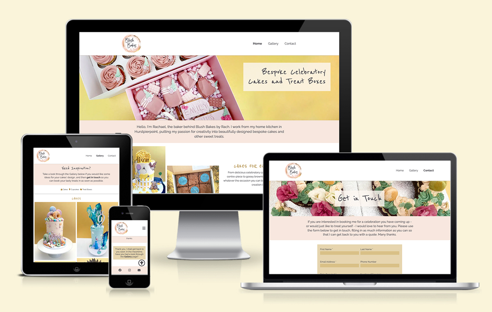
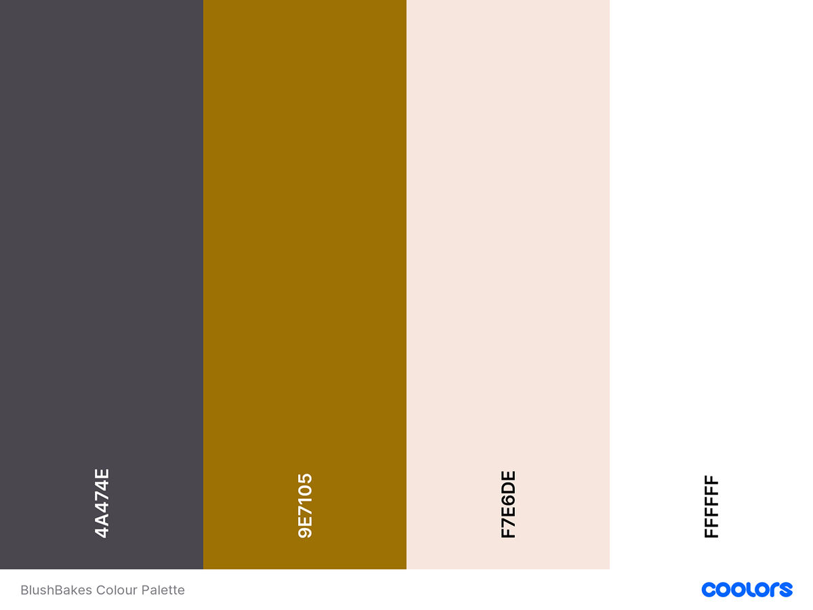
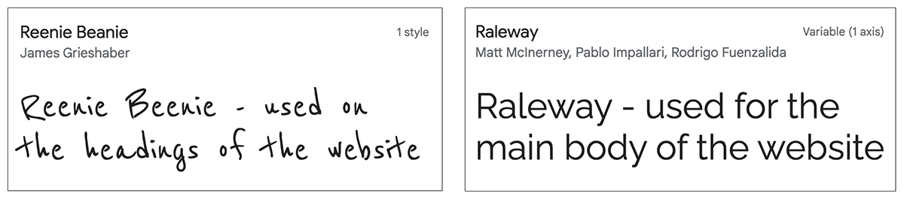
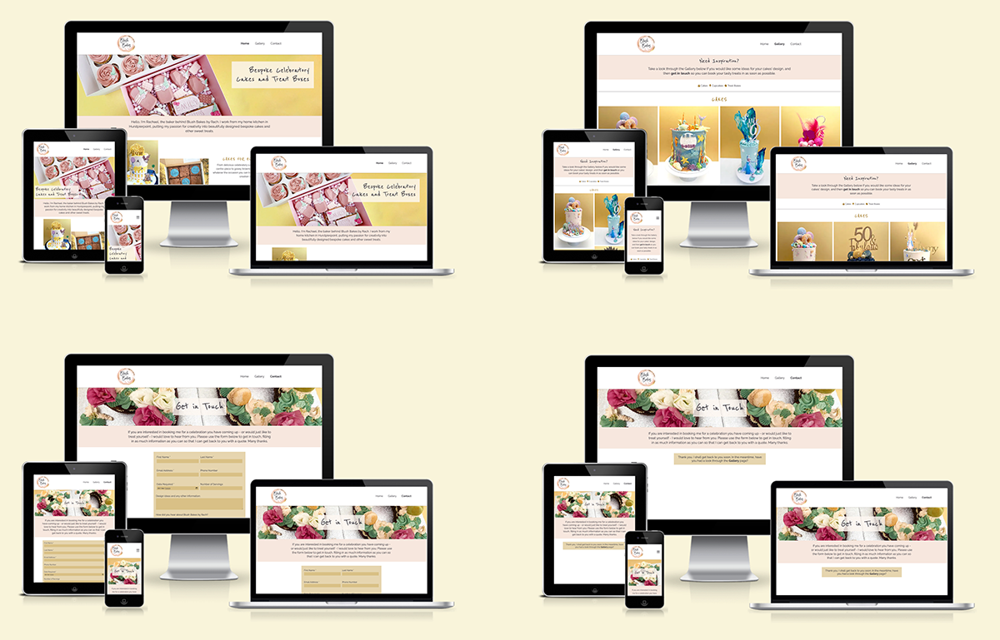
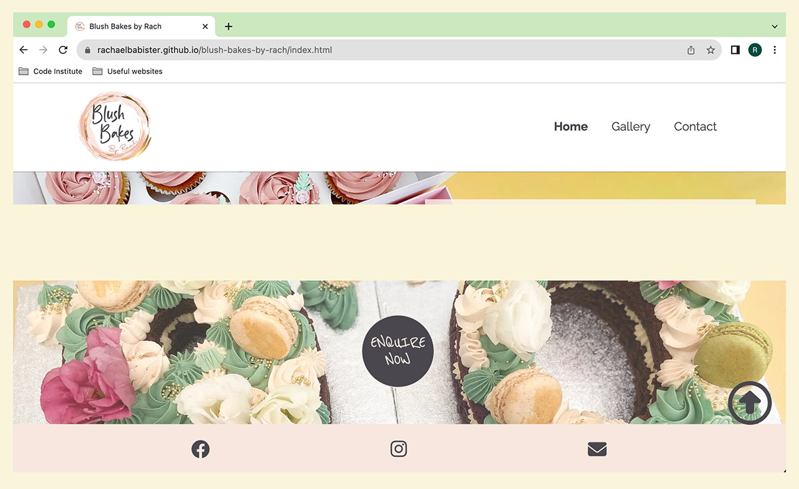

# BLUSH BAKES BY RACH

Welcome to Blush Bakes by Rach - a website for a real business, run by myself. I hadn't created a website for the business so thought it was the perfect opportunity for this first project. 

It has been built in html and css and designed to be responsive across all devices. As a visitor you can view a gallery of previously made cakes which aims to be enticing and encouraging, with a call-to-action to get in touch with the use of a form.

LIVE SITE

[You can view the live site here.](https://rachaelbabister.github.io/blush-bakes-by-rach)

GITHUB PAGES

[You can view the GitHub code pages here.](https://github.com/rachaelbabister/blush-bakes-by-rach)

---

## CONTENTS

- [BLUSH BAKES BY RACH](#blush-bakes-by-rach)
  - [CONTENTS](#contents)
  - [User Experience (UX)](#user-experience-ux)
    - [User Stories](#user-stories)
      - [Client Goals](#client-goals)
      - [First Time Visitor Goals](#first-time-visitor-goals)
      - [Returning Visitor Goals](#returning-visitor-goals)
      - [Frequent Visitor Goals](#frequent-visitor-goals)
  - [Design](#design)
    - [Colour Scheme](#colour-scheme)
    - [Typography](#typography)
    - [Imagery](#imagery)
    - [Wireframes](#wireframes)
  - [Features](#features)
    - [General features on each page](#general-features-on-each-page)
      - [Home Page](#home-page)
      - [Gallery](#gallery)
      - [Contact](#contact)
      - [Thank You](#thank-you)
    - [Future Implementations](#future-implementations)
    - [Accessibility](#accessibility)
  - [Technologies Used](#technologies-used)
    - [Languages Used](#languages-used)
    - [Frameworks, Libraries \& Programs Used](#frameworks-libraries--programs-used)
    - [Deployment](#deployment)
    - [Local Development](#local-development)
      - [How to Fork](#how-to-fork)
      - [How to Clone](#how-to-clone)
  - [Testing](#testing)
  - [Credits](#credits)
    - [Code Used](#code-used)
    - [Content](#content)
    - [Media](#media)
    - [Acknowledgments](#acknowledgments)

---

## User Experience (UX)

### User Stories

Blush Bakes by Rach is run by a local cake artist who would like to have more of an online presence. Although the business has Facebook and Instagram pages, they are aware that not everybody has social media. By having a website it enables the company to be more accessible online to more potential customers.

#### Client Goals

- For potential customers to see the variety of cakes and treat boxes available to order.
- To showcase previously made cakes so that customers can see the style of cakes Blush Bakes by Rach creates.
- To allow visitors to the site to get in touch with Blush Bakes by Rach with an enquiry.
- An informative contact form so that the visitor can fill in as much information as they can on their first contact.
- To be able to see and do all of the above on any device, whether a mobile phone or a desktop computer.

#### First Time Visitor Goals

- I want to see what cakes they have made in the past.
- I want to see what else they do other than cakes.
- I want to get in touch to see if they have availability for my celebration.
- I want to find information easily without too many clicks.
- I want to find out more on their Social Media pages.

#### Returning Visitor Goals

- I want to have another look at the gallery for inspiration.
- I want to follow up my previous viewing of the site to now get in touch with Blush Bakes by Rach.

#### Frequent Visitor Goals

- I want to see the cake I had made on the gallery page.
- I want to recommend Blush Bakes by Rach to friends and family.

---
## Design

### Colour Scheme

The colour scheme for the website came from the colours that have been used in the logo. The gold was originally a lighter gold, but in order to ensure good visibility against the light background, it was made slightly darker. The idea was to keep the website looking fresh and bright, whilst still easy to read.

### Typography

The fonts used on the website were chosen to contrast each other, with one being a cursive font to closely match the font within the logo, and the other a sans-serif to ensure the main body of the website can be read clearly.

Google Fonts was used to import both fonts:
- Reenie Beenie is the cursive font used on the headings. This uses both a bolder and a lighter font weight.
- Raleway is the sans-serif font used on the main body. It is mainly used in the normal weight, apart from links which are bold.

Font Awesome is also used for bullet points and the 'back to top' arrow on the website.

### Imagery

The type of imagery used on the website is all photography, with the odd Font Awesome icon appearing as a bullet point. The photos are all originals taken by myself.

### Wireframes

I created Wireframes for mobile, tablet and desktop using Balsamiq.

- [Mobile Phone Wireframe](assets/images/readme-images/mobile-wireframe.png)
- [Tablet Wireframe](assets/images/readme-images/tablet-wireframe.png)
- [Desktop Wireframe](assets/images/readme-images/desktop-wireframe.png)

There have been a few minor differences from these Wireframes on the website, mainly due to styling, but I tried to stick as close to them as possible.

---

## Features

The website contains 4 pages - home page, gallery, contact and a thank you page. Three of these can be accessed via the navigation menu. The thank you page is shown after a visitor has submitted the form on the contact page.

### General features on each page

- All pages show the logo on the left of the page and a responsive navigational bar on the right, in a header at the top of the page. 
- In a footer at the bottom of the page are the social media links for Facebook & Instagram, along with a link to the contact page. These are shown as icons.
- A favicon of the logo appears in the browser tab.
- In the bottom right corner, as you start to scroll down, an arrow appears which enables the user to get back to the top of the page.

#### Home Page

The home page features a bright hero image of some cupcakes and a treat box directly underneath the navigational header. There is some welcome text underneath, which introduces the baker and where they're based.

The next section is broken down into images and text, to showcase some of the cakes and treat boxes, and gives the user ideas as to what they can order and for who.

Just above the footer there is another image banner with a call to action to take you to the contact page.

#### Gallery

In this top section below the menu header, it starts by asking if the user needs inspiration and to take a look at the gallery. There are 3 anchor links (cakes, cupcakes and treat boxes) which when clicked take you to the appropriate part of the gallery.

The same call to action banner is also at the bottom above the footer.

#### Contact

To bring some colour and interest to this page there is a colourful cake banner image below the menu section. It invites users to get in touch using the contact form. Some elements are required before the form can be submitted, and users do get alerted when they haven't filled in these elements.

#### Thank You

A simple page with the same styling as the Contact page. The form elements have been removed and replaced with a 'thank you for submitting' message.

### Future Implementations

- A new page with standard pricing and examples of cakes and their pricing.
- An information page giving users cake care and cutting guides.
- A suppliers page - recommendations of where to buy supplies.
- A 'recipe' page which details flavours available for sponge and fillings, and what options of treat boxes are available.
What features would you like to implement in the future on your site? Would you like to add more pages, or create login functionality? Add these plans here.

### Accessibility

I have tried to ensure the site has been made as accessible as possible by:

- Using semantic HTML.
- Using alt attributes on images where available.
- Adding aria-labels for screen labels.
- Using colour contrasts between the text and background.

---

## Technologies Used

### Languages Used

HTML and CSS were used to create this website.

### Frameworks, Libraries & Programs Used

- [Balsamiq](https://balsamiq.com/) - to create Wireframes.
- [Codeanywhere](https://app.codeanywhere.com/) - cross platform cloud IDE to deploy workspace environment to Github.
- [Github](https://github.com/) - to store and dislay all files and assets for the website.
- [Google Fonts](https://fonts.google.com/) - to import the fonts used on the website.
- [Font Awesome](https://fontawesome.com/icons) - to use icons on the website.
- [Google Dev Tools](https://developer.chrome.com/docs/) - to troubleshoot, test and solve issues with any styling.
- [W3C Markup Validator](https://validator.w3.org/) - to check the source code of my html files for any bugs.
- [W3C CSS Validator](https://jigsaw.w3.org/css-validator/) - to check the source code of my css file for any bugs.
- Photoshop 2023 - to optimise images for the website.
- [Am I Responsive?](https://ui.dev/amiresponsive?) - to showcase the website on different devices.

Add any frameworks, libraries or programs used while creating your project.

### Deployment

I used Github Pages to deploy the live website. To deploy a website on Github, follow these steps:

1. Log in to Github - or set up a new account.
2. Find the repository for [Blush Bakes by Rach](https://github.com/rachaelbabister/blush-bakes-by-rach).
3. Click on 'Settings' along the top.
4. Click on 'Pages' in the left hand side navigation bar.
5. In the 'Source' section, ensure 'Deploy from a branch' is selected. Choose 'main' and 'Root' from the drop down menus and click Save.
6. Your live site is now deployed and can be viewed using the link provided.

### Local Development

#### How to Fork

To fork a repository on Github, follow these steps:

1. Log in to Github - or step up a new account.
2. Click on the repository for [Blush Bakes by Rach](https://github.com/rachaelbabister/blush-bakes-by-rach).
3. Click the Fork button in the top right corner.

#### How to Clone

To clone a repository on Github, follow these steps:

1. Log in to Github - or step up a new account.
2. Find the repository for [Blush Bakes by Rach](https://github.com/rachaelbabister/blush-bakes-by-rach).
3. Click on the code button, select whether you would like to clone with HTTPS, SSH or GitHub CLI and copy the link shown.
4. Open the terminal in your code editor and change the current working directory to the location you want to use for the cloned directory.
5. Type 'git clone' into the terminal and paste the link you copied in step 3. Press enter.

- - -

## Testing

I have learnt from this project to ensure I start my TESTING file from the begining in future. I continually test the site as I go along and have fixed many small issues that didn't work straight away, but unfortunately these weren't catalogued.

In the TESTING file linked below, you can see the tests and fixes I did manage to catalogue.
  
[TESTING.md file](TESTING.md)

---

## Credits

### Code Used

- [W3Schools](https://www.w3schools.com/howto/howto_css_transition_hover.asp) - helped to style my buttons to have a smoother transition. I also used them for a Font Awesome tooltip, but have since removed the element that used it.
- [W3Docs](https://www.w3docs.com/snippets/css/display-the-hidden-element-on-hovering-over-hyperlink-or-a-tag.html) - helped to display an element on hover.
- [RapidTables](https://www.rapidtables.com/convert/color/hex-to-rgb.html) - converting hex colours to rgb values.
- [Stack Overflow](https://stackoverflow.com/questions/51893686/css-columns-fill-row-first) - helped to style my gallery page so that the columns filled the rows across first, rather than down.
- [Free Code Camp](https://www.freecodecamp.org/news/css-only-back-to-top-button/) - helped to code the 'back to top' button using only html and css.
- [W3Docs](https://www.w3docs.com/tools/code-editor/3033) - styling to increase the checkbox size in the contact form.
- [Soft Author](https://softauthor.com/css-flexbox-responsive-registration-form-with-source-code/) - used the code in order to help make the contact form responsive by having the form elements go into two columns on a bigger screen.
- I also used the [Love Running](https://rachaelbabister.github.io/loverunning/) project I created with [Code Institute](https://codeinstitute.net/) to help with some coding.

### Content

All content used on the site was written by Rachael Babister.

### Media

All photos were taken by Rachael Babister and are originals. Icons used on the site are Font Awesome icons.
  
### Acknowledgments

I would like to thank the following people for their help, whether directly or indirectly!

- My two daughters who have been very patient with me whilst doing this project, and helping to walk the dog and clean the house!
- My Code Institute Mentor [Jubril Akolade](https://www.linkedin.com/in/jubrillionaire/?originalSubdomain=ca).
- Members of the Code Institute Slack community. Although I didn't ask any direct questions for help, when searching for little queries, I always managed to find the answer!
- My friend Victoria Walters who has had to listen to me chat about code for far too long! And for looking over my site and checking for errors.
- My friend Kelly Bates who knows nothing about code but still happily looked through my live site for me checking for any issues - and bringing some to my attention!
- [Stuart Crang](https://www.linkedin.com/in/stuart-crang-50401897/) from Code Institute who signed me up to the course! I hope you like my first project!
