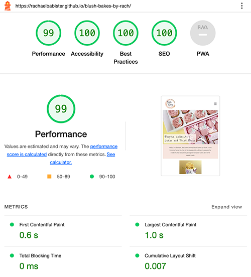
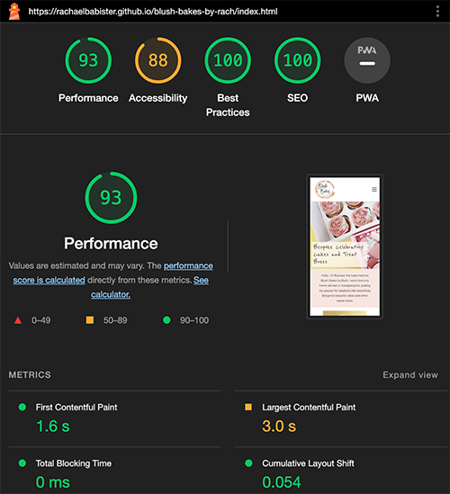
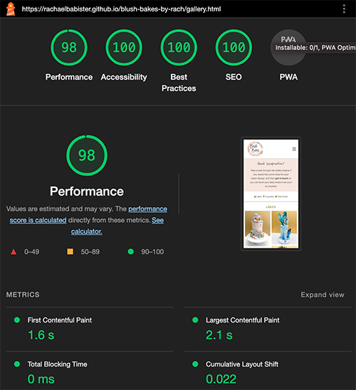

# BLUSH BAKES BY RACH - TESTING

LIVE SITE

[You can view the live site here.](https://rachaelbabister.github.io/blush-bakes-by-rach)

## CONTENTS

- [BLUSH BAKES BY RACH - TESTING](#blush-bakes-by-rach---testing)
  - [CONTENTS](#contents)
  - [AUTOMATED TESTING](#automated-testing)
    - [W3C Validator](#w3c-validator)
    - [Lighthouse](#lighthouse)
    - [Desktop Results](#desktop-results)
    - [Mobile Results](#mobile-results)

Although I have been testing the site throughout the entire build, I made the crucial mistake of not documenting all the bugs I have fixed from the start. I will learn to do this on my other projects!

Chrome Developer Tools was very useful in being able to pinpoint the code that needed tweaking to get elements working.

I used the W3C Validator to check my html and css source code, and also LightHouse within Chrome Developer Tools to test the performance and accessibility. These are explained in more detail below.

- - -

## AUTOMATED TESTING

### W3C Validator

[W3C](https://validator.w3.org/) was used to validate the source code for both the html and css on all pages of the website. 

The first check revealed a few errors.

- [index.html](assets/images/readme-images/index-validator.png)
  - Logo image had the wrong start tag. Amended 'image' to 'img'
  - A duplicate ID was changed to a div.
  - Removed the a tag and used a 'onclick' on the button instead.
  - Changed the empty sections for divs instead.
  - Removed the aria-label from the div.
- [gallery.html](assets/images/readme-images/gallery-validator.png)
  - Logo image tag was changed to img.
  - Button code was amended.
  - Changed sections to divs.
  - Removed aria-label
- [contact.html](assets/images/readme-images/contact-validator.png)
  - Logo image tag was changed to img.
  - Sections were changed to divs.
- [thankyou.html](assets/images/readme-images/thankyou-validator.png) 
  - Logo image tag was changed to img.
  - Sections were changed to divs.
- style.css 
  - No screenshot, however there was a missing curly bracket, and a parse error with a display:block class that wasn't related to anything. This was removed.

- - -

### Lighthouse

I used Lighthouse within the Chrome Developer Tools to test the performance, accessibility, best practices and SEO of the website.

### Desktop Results

Desktop results had good high figures - all in the green. Happy to see Accessibility is 100.

- index.html
  

- gallery.html
  

- contact.html
  

- thankyou.html
  

### Mobile Results

The accessibility on the index page came out lower than hoped, but this check was taken before the above validator bugs were fixed.

- index.html
  

The results after the bugs and errors had all been fixed were as follows:

- index.html
  

- gallery.html
  

- contact.html
  

- thankyou.html
  

